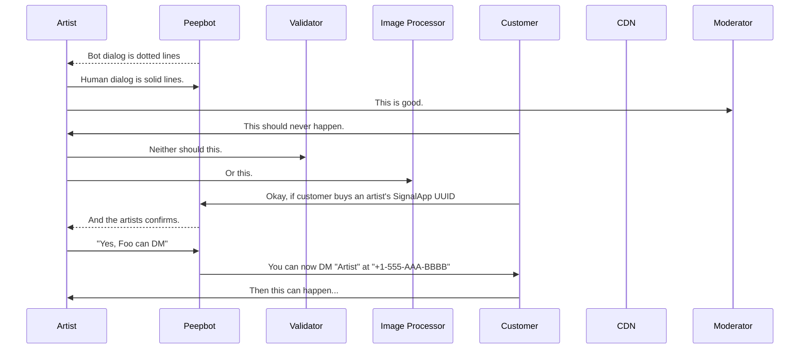

# Peep-Spec
User workflows and technical specification for Peep: Encrypted Exchange Program

## Peep, for artists

> so we're building a "content marketplace" that lets artists sell their content like onlyfans or fansly, get paid 90% 60seconds later by the creator's choice of amazon wishlist items, store credit, or like... cash app transfer
> 
> the fancy part is that we are actually trying to let folks setup their own stores, even if they don't know anything about making their own website, and do it in a way that's really really cheap (free?) to run
> 
> and then you can link your store & profile with your friends stores and vice-versa, and everyone linked shares whatever costs (and maybe some small % of what you each earn, so that if someone has a bad month, they still can make a base amount)

### Basics of Mermaid and the System

[![basics on mermaid.ink](https://mermaid.ink/img/eyJjb2RlIjoic2VxdWVuY2VEaWFncmFtXG4gICAgcGFydGljaXBhbnQgQSBhcyBBcnRpc3RcbiAgICBwYXJ0aWNpcGFudCBQIGFzIFBlZXBib3RcbiAgICBwYXJ0aWNpcGFudCBWIGFzIFZhbGlkYXRvclxuICAgIHBhcnRpY2lwYW50IEkgYXMgSW1hZ2UgUHJvY2Vzc29yXG4gICAgcGFydGljaXBhbnQgQyBhcyBDdXN0b21lclxuICAgIHBhcnRpY2lwYW50IENETiBhcyBDRE5cbiAgICBwYXJ0aWNpcGFudCBNIGFzIE1vZGVyYXRvclxuICAgIFAtLT4-QTogQm90IGRpYWxvZyBpcyBkb3R0ZWQgbGluZXNcbiAgICBBLT4-UDogSHVtYW4gZGlhbG9nIGlzIHNvbGlkIGxpbmVzLlxuICAgIEEtPj5NOiBUaGlzIGlzIGdvb2QuXG4gICAgQy0-PkE6IFRoaXMgc2hvdWxkIG5ldmVyIGhhcHBlbi5cbiAgICBBLT4-VjogTmVpdGhlciBzaG91bGQgdGhpcy5cbiAgICBBLT4-STogT3IgdGhpcy5cbiAgICBDLT4-UDogT2theSwgaWYgY3VzdG9tZXIgYnV5cyBhbiBhcnRpc3QncyBTaWduYWxBcHAgVVVJRFxuICAgIFAtLT4-QTogQW5kIHRoZSBhcnRpc3RzIGNvbmZpcm1zLlxuICAgIEEtPj5QOiBcIlllcywgRm9vIGNhbiBETVwiXG4gICAgUC0-PkM6IFlvdSBjYW4gbm93IERNIFwiQXJ0aXN0XCIgYXQgXCIrMS01NTUtQUFBLUJCQkJcIlxuICAgIEMtPj5BOiBUaGVuIHRoaXMgY2FuIGhhcHBlbi4uLiIsIm1lcm1haWQiOnsidGhlbWUiOiJkZWZhdWx0In0sInVwZGF0ZUVkaXRvciI6ZmFsc2UsImF1dG9TeW5jIjp0cnVlLCJ1cGRhdGVEaWFncmFtIjpmYWxzZX0)](https://mermaid-js.github.io/mermaid-live-editor/edit/#eyJjb2RlIjoic2VxdWVuY2VEaWFncmFtXG4gICAgcGFydGljaXBhbnQgQSBhcyBBcnRpc3RcbiAgICBwYXJ0aWNpcGFudCBQIGFzIFBlZXBib3RcbiAgICBwYXJ0aWNpcGFudCBWIGFzIFZhbGlkYXRvclxuICAgIHBhcnRpY2lwYW50IEkgYXMgSW1hZ2UgUHJvY2Vzc29yXG4gICAgcGFydGljaXBhbnQgQyBhcyBDdXN0b21lclxuICAgIHBhcnRpY2lwYW50IENETiBhcyBDRE5cbiAgICBwYXJ0aWNpcGFudCBNIGFzIE1vZGVyYXRvclxuICAgIFAtLT4-QTogQm90IGRpYWxvZyBpcyBkb3R0ZWQgbGluZXNcbiAgICBBLT4-UDogSHVtYW4gZGlhbG9nIGlzIHNvbGlkIGxpbmVzLlxuICAgIEEtPj5NOiBUaGlzIGlzIGdvb2QuXG4gICAgQy0-PkE6IFRoaXMgc2hvdWxkIG5ldmVyIGhhcHBlbi5cbiAgICBBLT4-VjogTmVpdGhlciBzaG91bGQgdGhpcy5cbiAgICBBLT4-STogT3IgdGhpcy5cbiAgICBDLT4-UDogT2theSwgaWYgY3VzdG9tZXIgYnV5cyBhbiBhcnRpc3QncyBTaWduYWxBcHAgVVVJRFxuICAgIFAtLT4-QTogQW5kIHRoZSBhcnRpc3RzIGNvbmZpcm1zLlxuICAgIEEtPj5QOiBcIlllcywgRm9vIGNhbiBETVwiXG4gICAgUC0-PkM6IFlvdSBjYW4gbm93IERNIFwiQXJ0aXN0XCIgYXQgXCIrMS01NTUtQUFBLUJCQkJcIlxuICAgIEMtPj5BOiBUaGVuIHRoaXMgY2FuIGhhcHBlbi4uLiIsIm1lcm1haWQiOiJ7XG4gIFwidGhlbWVcIjogXCJkZWZhdWx0XCJcbn0iLCJ1cGRhdGVFZGl0b3IiOmZhbHNlLCJhdXRvU3luYyI6dHJ1ZSwidXBkYXRlRGlhZ3JhbSI6ZmFsc2V9)

### New set workflow.
[![Available on mermaid.ink](https://mermaid.ink/img/eyJjb2RlIjoic2VxdWVuY2VEaWFncmFtXG4gICAgcGFydGljaXBhbnQgQSBhcyBBcnRpc3RcbiAgICBwYXJ0aWNpcGFudCBQIGFzIFBlZXBib3RcbiAgICBwYXJ0aWNpcGFudCBWIGFzIFZhbGlkYXRvclxuICAgIHBhcnRpY2lwYW50IEkgYXMgSW1hZ2UgUHJvY2Vzc29yXG4gICAgcGFydGljaXBhbnQgQyBhcyBDRE5cbiAgICBBLT4-UDogSSdkIGxpa2UgdG8gcHVibGlzaCBhIG5ldyBzZXQhXG4gICAgbm90ZSBsZWZ0IG9mIFA6IE1hdGNoIG9uIFwibmV3IHNldFwiXG4gICAgUC0tPj5BOiBHcmVhdCEgSG93IHNob3VsZCB3ZSByZWZlciB0byB0aGlzIHNldD9cbiAgICBQLS0-PitBOiBQbGVhc2Ugc3VnZ2VzdCBhIHRpdGxlIVxuICAgIG5vdGUgb3ZlciBBOiBTZXQgVGl0bGVcbiAgICBBLT4-UDogXCJCdWlsZGluZyBhIExlZ28gQ2FzdGxlIHdpdGggbXkgR2lybGZyaWVuZHNcIlxuICAgIG5vdGUgb3ZlciBBOiBDdXN0b20gdGVybSBjb25maWd1cmF0aW9uOlxuICAgIFAtLT4-QTogV291bGQgeW91IGxpa2UgdG8gdXNlIHlvdXIgbm9ybWFsIHRlcm1zP1xuICAgIEEtPj5QOiBOb1xuICAgIG5vdGUgcmlnaHQgb2YgUDogTm9ybWFsIHRlcm1zIGNhbiBiZSBjb25maWd1cmVkIHNlcGFyYXRlbHkuXG4gICAgbm90ZSByaWdodCBvZiBQOiBJdCdzIGxpa2VseSBtb3N0IHNldHMgd2lsbCB1c2UgdGhlIG5vbWluYWwgY29uZmlnLlxuICAgIG5vdGUgb3ZlciBBOiBQdWJsaWMvU3Vic2NyaWJlciBBdmFpbFxuICAgIFAtLT4-QTogU2hvdWxkIHRoaXMgY29udGVudCBiZSBtYWRlIGF2YWlsYWJsZSB0byBldmVyeW9uZT9cbiAgICBBLT4-K1A6IEp1c3Qgc3Vic2NyaWJlcnMhXG4gICAgbm90ZSBvdmVyIEE6IFNldCBkbCBvciB2aWV3IG9uY2U_XG4gICAgUC0tPj5BOiBTaG91bGQgdGhpcyBjb250ZW50IGJlIGF2YWlsYWJsZSBmb3IgZG93bmxvYWQgb3IganVzdCB2aWV3LW9uY2U_XG4gICAgQS0-PlA6IERvd25sb2FkXG4gICAgUC0tPj5BOiBXaGF0IHByaWNlIHRvIGRvd25sb2FkP1xuICAgIEEtPj5QOiAkMTBcbiAgICBub3RlIG92ZXIgQTogU2V0IFByZXZpZXdcbiAgICBQLS0-PkE6IFdoYXQgaW1hZ2UgdG8gdXNlIGZvciBhZHZlcnRpc2luZyBhbmQgcHJvbW90aW5nIHRoaXMgc2V0P1xuICAgIEEtPj5QOiDwn5a877iP8J-WvO-4j1xuICAgIG5vdGUgcmlnaHQgb2YgUDogRGlzYXBwZWFyaW5nIG1lc3NhZ2VzIDYwbWluLlxuICAgIFAtLT4-QTogV2UgcmVjZWl2ZWQgdHdvIGltYWdlcywgYnV0IHlvdXIgZmFjZSBpcyBub3QgdmlzaWJsZSBpbiBlaXRoZXIuXG4gICAgUC0tPkE6IFdvdWxkIHlvdSBzZW5kIGEgc2VsZmllIHRvIGNvbmZpcm0geW91ciBpZGVudGl0eT8gVGhpcyB3aWxsIGJlIHVzZWQgZm9yIHZhbGlkYXRpb24gb25seS5cbiAgICBBLT4-UDog8J-ksyBcbiAgICBQLS0-PlY6IGRpZmYocGhhc2go8J-ksyksIHVzZXJfcGhhc2gpID4gMC43MD9cbiAgICBWLS0-PlA6IHllc1xuICAgIFAtLT4-QTogVGhhbmtzIGZvciB0YWtpbmcgYSBzZWNvbmQgdG8gaGVscCBrZWVwIHRoZSBjb21tdW5pdHkgc3RheSBzYWZlLlxuICAgIG5vdGUgb3ZlciBBOiBDb250ZW50XG4gICAgUC0tPj5BOiBTZW5kIHRoZSBjb250ZW50IHlvdSB3aXNoIHRvIGluY2x1ZGUgaW4gdGhlIHNldCFcbiAgICBQLS0-QTogRG9uJ3QgZm9yZ2V0IGFib3V0IFNpZ25hbCdzIHBob3RvIGVkaXRpbmchXG4gICAgUC0tPkE6IFlvdSdyZSB3ZWxjb21lIHRvIGJsdXIgZmFjZXMsIGNyb3AgaW1hZ2VzLCBhbmQgYWRkIGVtb2ppIHRvIHBob3Rvcy5cbiAgICBQLS0-QTogV2hlbiB5b3UncmUgZG9uZSBhZGRpbmcgY29udGVudCB0byA8c2V0PiBhbmQgYWxsIHRoZSBwaG90b3MgaGF2ZSB1cGxvYWRlZCwg8J-RjSB0aGlzLlxuICAgIEEtPj4rUDog8J-WvO-4j_CflrzvuI_wn5a877iP8J-WvO-4jyDwn5a877iP8J-WvO-4j_CflrzvuI_wn5a877iPIPCfjqUg8J-OpVxuICAgIEEtPlA6IC4uLlxuICAgIEEtPj5QOiBkb25lIVxuICAgIFAtLT4-QTogTG9va3MgbGlrZSB0aGVyZSBhcmUgMiB2aWRlb3MgYW5kIDggcGhvdG9zIGluIHRoaXMgc2V0IVxuICAgIFAtLT5BOiBXZSdsbCB3YXRlcm1hcmsgdGhlc2Ugd2l0aCB5b3VyIHVzZXJuYW1lIGxpa2UgdXN1YWwgYW5kXG4gICAgUC0tPkE6IHdlJ2xsIHNlbmQgeW91IGEgcHJldmlldyBvZiB5b3VyIHVwZGF0ZWQgcG9ydGZvbGlvIHdoZW4gaXQncyByZWFkeSFcbiAgICBQLS0-QTogWW91IHdpbGwgdGhlbiBiZSBhYmxlIHRvIGNvbmZpcm0gYmVmb3JlIGl0J3MgbWFkZSBhdmFpbGFibGUuXG4gICAgUC0tPj5JOiB7VVVJRCwgUHJldmlldzog8J-WvO-4j_CflrzvuI8sIFNldDog8J-WvO-4j3g4IPCfjqV4MiwgbWV0YWRhdGE6IC4uLn1cbiAgICBJLS0-PkM6IENvbnRlbnQrTWV0YWRhdGFcbiAgICBDLS0-PlA6IHtVVUlEOiBsaW5rc31cbiAgICBJLS0-PlA6IFJlbmRlcmVkIHBvcnRmb2xpbzog8J-WvO-4j1xuICAgIG5vdGUgb3ZlciBBOiBDb25maXJtYXRpb25cbiAgICBQLS0-PkE6IEhlcmUncyB5b3VyIG5ldyBwb3J0Zm9saW8hIEV2ZXJ5dGhpbmcgbG9vayBnb29kP1xuICAgIEEtPj5QOiBZZXMhIFRoYW5rcyFcbiIsIm1lcm1haWQiOnsidGhlbWUiOiJkZWZhdWx0In0sInVwZGF0ZUVkaXRvciI6ZmFsc2UsImF1dG9TeW5jIjp0cnVlLCJ1cGRhdGVEaWFncmFtIjpmYWxzZX0)](https://mermaid-js.github.io/mermaid-live-editor/edit/#eyJjb2RlIjoic2VxdWVuY2VEaWFncmFtXG4gICAgcGFydGljaXBhbnQgQSBhcyBBcnRpc3RcbiAgICBwYXJ0aWNpcGFudCBQIGFzIFBlZXBib3RcbiAgICBwYXJ0aWNpcGFudCBWIGFzIFZhbGlkYXRvclxuICAgIHBhcnRpY2lwYW50IEkgYXMgSW1hZ2UgUHJvY2Vzc29yXG4gICAgcGFydGljaXBhbnQgQyBhcyBDRE5cbiAgICBBLT4-UDogSSdkIGxpa2UgdG8gcHVibGlzaCBhIG5ldyBzZXQhXG4gICAgbm90ZSBsZWZ0IG9mIFA6IE1hdGNoIG9uIFwibmV3IHNldFwiXG4gICAgUC0tPj5BOiBHcmVhdCEgSG93IHNob3VsZCB3ZSByZWZlciB0byB0aGlzIHNldD9cbiAgICBQLS0-PitBOiBQbGVhc2Ugc3VnZ2VzdCBhIHRpdGxlIVxuICAgIG5vdGUgb3ZlciBBOiBTZXQgVGl0bGVcbiAgICBBLT4-UDogXCJCdWlsZGluZyBhIExlZ28gQ2FzdGxlIHdpdGggbXkgR2lybGZyaWVuZHNcIlxuICAgIG5vdGUgb3ZlciBBOiBDdXN0b20gdGVybSBjb25maWd1cmF0aW9uOlxuICAgIFAtLT4-QTogV291bGQgeW91IGxpa2UgdG8gdXNlIHlvdXIgbm9ybWFsIHRlcm1zP1xuICAgIEEtPj5QOiBOb1xuICAgIG5vdGUgcmlnaHQgb2YgUDogTm9ybWFsIHRlcm1zIGNhbiBiZSBjb25maWd1cmVkIHNlcGFyYXRlbHkuXG4gICAgbm90ZSByaWdodCBvZiBQOiBJdCdzIGxpa2VseSBtb3N0IHNldHMgd2lsbCB1c2UgdGhlIG5vbWluYWwgY29uZmlnLlxuICAgIG5vdGUgb3ZlciBBOiBQdWJsaWMvU3Vic2NyaWJlciBBdmFpbFxuICAgIFAtLT4-QTogU2hvdWxkIHRoaXMgY29udGVudCBiZSBtYWRlIGF2YWlsYWJsZSB0byBldmVyeW9uZT9cbiAgICBBLT4-K1A6IEp1c3Qgc3Vic2NyaWJlcnMhXG4gICAgbm90ZSBvdmVyIEE6IFNldCBkbCBvciB2aWV3IG9uY2U_XG4gICAgUC0tPj5BOiBTaG91bGQgdGhpcyBjb250ZW50IGJlIGF2YWlsYWJsZSBmb3IgZG93bmxvYWQgb3IganVzdCB2aWV3LW9uY2U_XG4gICAgQS0-PlA6IERvd25sb2FkXG4gICAgUC0tPj5BOiBXaGF0IHByaWNlIHRvIGRvd25sb2FkP1xuICAgIEEtPj5QOiAkMTBcbiAgICBub3RlIG92ZXIgQTogU2V0IFByZXZpZXdcbiAgICBQLS0-PkE6IFdoYXQgaW1hZ2UgdG8gdXNlIGZvciBhZHZlcnRpc2luZyBhbmQgcHJvbW90aW5nIHRoaXMgc2V0P1xuICAgIEEtPj5QOiDwn5a877iP8J-WvO-4j1xuICAgIG5vdGUgcmlnaHQgb2YgUDogRGlzYXBwZWFyaW5nIG1lc3NhZ2VzIDYwbWluLlxuICAgIFAtLT4-QTogV2UgcmVjZWl2ZWQgdHdvIGltYWdlcywgYnV0IHlvdXIgZmFjZSBpcyBub3QgdmlzaWJsZSBpbiBlaXRoZXIuXG4gICAgUC0tPkE6IFdvdWxkIHlvdSBzZW5kIGEgc2VsZmllIHRvIGNvbmZpcm0geW91ciBpZGVudGl0eT8gVGhpcyB3aWxsIGJlIHVzZWQgZm9yIHZhbGlkYXRpb24gb25seS5cbiAgICBBLT4-UDog8J-ksyBcbiAgICBQLS0-PlY6IGRpZmYocGhhc2go8J-ksyksIHVzZXJfcGhhc2gpID4gMC43MD9cbiAgICBWLS0-PlA6IHllc1xuICAgIFAtLT4-QTogVGhhbmtzIGZvciB0YWtpbmcgYSBzZWNvbmQgdG8gaGVscCBrZWVwIHRoZSBjb21tdW5pdHkgc3RheSBzYWZlLlxuICAgIG5vdGUgb3ZlciBBOiBDb250ZW50XG4gICAgUC0tPj5BOiBTZW5kIHRoZSBjb250ZW50IHlvdSB3aXNoIHRvIGluY2x1ZGUgaW4gdGhlIHNldCFcbiAgICBQLS0-QTogRG9uJ3QgZm9yZ2V0IGFib3V0IFNpZ25hbCdzIHBob3RvIGVkaXRpbmchXG4gICAgUC0tPkE6IFlvdSdyZSB3ZWxjb21lIHRvIGJsdXIgZmFjZXMsIGNyb3AgaW1hZ2VzLCBhbmQgYWRkIGVtb2ppIHRvIHBob3Rvcy5cbiAgICBQLS0-QTogV2hlbiB5b3UncmUgZG9uZSBhZGRpbmcgY29udGVudCB0byA8c2V0PiBhbmQgYWxsIHRoZSBwaG90b3MgaGF2ZSB1cGxvYWRlZCwg8J-RjSB0aGlzLlxuICAgIEEtPj4rUDog8J-WvO-4j_CflrzvuI_wn5a877iP8J-WvO-4jyDwn5a877iP8J-WvO-4j_CflrzvuI_wn5a877iPIPCfjqUg8J-OpVxuICAgIEEtPlA6IC4uLlxuICAgIEEtPj5QOiBkb25lIVxuICAgIFAtLT4-QTogTG9va3MgbGlrZSB0aGVyZSBhcmUgMiB2aWRlb3MgYW5kIDggcGhvdG9zIGluIHRoaXMgc2V0IVxuICAgIFAtLT5BOiBXZSdsbCB3YXRlcm1hcmsgdGhlc2Ugd2l0aCB5b3VyIHVzZXJuYW1lIGxpa2UgdXN1YWwgYW5kXG4gICAgUC0tPkE6IHdlJ2xsIHNlbmQgeW91IGEgcHJldmlldyBvZiB5b3VyIHVwZGF0ZWQgcG9ydGZvbGlvIHdoZW4gaXQncyByZWFkeSFcbiAgICBQLS0-QTogWW91IHdpbGwgdGhlbiBiZSBhYmxlIHRvIGNvbmZpcm0gYmVmb3JlIGl0J3MgbWFkZSBhdmFpbGFibGUuXG4gICAgUC0tPj5JOiB7VVVJRCwgUHJldmlldzog8J-WvO-4j_CflrzvuI8sIFNldDog8J-WvO-4j3g4IPCfjqV4MiwgbWV0YWRhdGE6IC4uLn1cbiAgICBJLS0-PkM6IENvbnRlbnQrTWV0YWRhdGFcbiAgICBDLS0-PlA6IHtVVUlEOiBsaW5rc31cbiAgICBJLS0-PlA6IFJlbmRlcmVkIHBvcnRmb2xpbzog8J-WvO-4j1xuICAgIG5vdGUgb3ZlciBBOiBDb25maXJtYXRpb25cbiAgICBQLS0-PkE6IEhlcmUncyB5b3VyIG5ldyBwb3J0Zm9saW8hIEV2ZXJ5dGhpbmcgbG9vayBnb29kP1xuICAgIEEtPj5QOiBZZXMhIFRoYW5rcyFcbiIsIm1lcm1haWQiOiJ7XG4gIFwidGhlbWVcIjogXCJkZWZhdWx0XCJcbn0iLCJ1cGRhdGVFZGl0b3IiOmZhbHNlLCJhdXRvU3luYyI6dHJ1ZSwidXBkYXRlRGlhZ3JhbSI6ZmFsc2V9)
